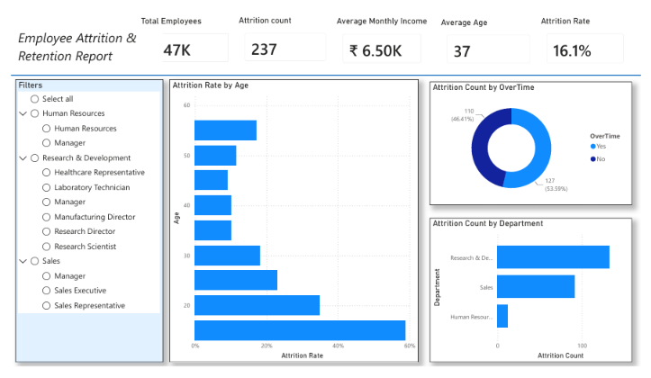
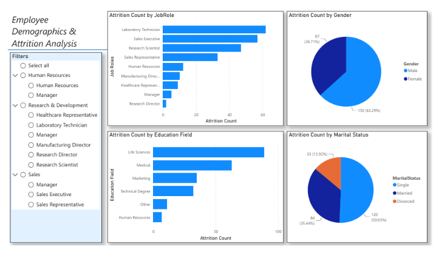
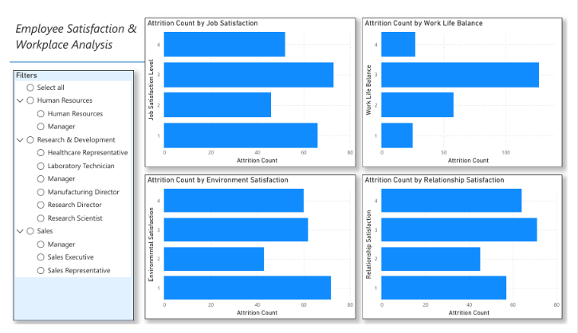

# 📊 HR Analytics Dashboard | Employee Attrition Analysis

<p align="center">


</p>

---

# 📌 Project Overview

Employee attrition is a significant challenge for organizations, leading to increased recruitment expenses, loss of experienced employees, reduced productivity, and higher training costs. Understanding why employees leave is essential for building effective retention strategies.

This project analyzes employee attrition using SQL and Power BI to identify workforce trends, uncover the key drivers behind employee turnover, and provide meaningful insights that support strategic HR decision-making.

Rather than relying on assumptions, this dashboard enables HR teams and business leaders to make data-driven decisions by highlighting where employee turnover occurs, who is leaving, and which workplace factors contribute the most to attrition.

---

# 🎯 Project Goal

The primary goal of this project is to identify the root causes of employee attrition and provide actionable insights that help organizations retain employees and reduce recruitment costs.

This dashboard is designed to function as a business intelligence tool that answers critical workforce questions through data visualization and analytics.

---

# 🎯 Business Objectives

This project focuses on achieving the following business objectives:

- **Expose Attrition Triggers** – Identify hidden patterns and relationships behind employee resignations, including the impact of overtime, salary, age, and job role.

- **Locate High-Risk Departments** – Identify departments experiencing the highest employee turnover so that management can implement targeted retention strategies.

- **Drive Cost Savings** – Support leadership with reliable insights that reduce recruitment, onboarding, and employee replacement costs through improved retention planning.

- **Reduce Financial Losses** – Help organizations understand the financial impact of attrition by identifying factors contributing to employee turnover.

- **Mitigate Employee Burnout** – Analyze overtime and work-life balance trends to identify workplace conditions that may increase employee resignations.

- **Build a Data-Driven HR Culture** – Replace intuition-based decision-making with analytical insights derived from historical employee data.

---

# ❓ Business Questions Answered

This dashboard answers several important business questions:

### 1️⃣ How severe is employee attrition?

The dashboard calculates the overall attrition rate and provides a clear overview of employee turnover across the organization.

### 2️⃣ Which departments experience the highest employee turnover?

Department-level analysis identifies the business units where employee departures are concentrated, allowing management to prioritize retention efforts.

### 3️⃣ Is overtime contributing to employee resignations?

The dashboard evaluates the relationship between overtime and attrition to determine whether excessive workloads influence employee turnover.

### 4️⃣ Which age groups are leaving the organization?

Age-based analysis highlights the career stages where attrition is highest, helping HR understand workforce stability across different age groups.

### 5️⃣ Which employee groups are most likely to resign?

Demographic analysis compares attrition across gender, marital status, education field, and job roles to identify high-risk employee segments.

---

# 🛠️ Tools & Technologies

| Technology | Purpose |
|------------|---------|
| MySQL | Database Management |
| SQL | Data Cleaning & Data Preparation |
| RDBMS | Relational Database Management |
| Power BI | Interactive Dashboard Development |
| Power Query | Data Transformation |

---

# 📂 Project Workflow

### Database Setup

- Created the HR Analytics database.
- Imported employee data into MySQL.
- Verified database integrity before analysis.

---

### Data Cleaning

Performed SQL-based preprocessing including:

- Handling missing values
- Removing duplicate records
- Standardizing categorical values
- Preparing clean datasets for analysis
- Creating analysis-ready tables

---

### Data Preparation

- Built SQL Views for reporting.
- Structured datasets for Power BI visualization.
- Prepared business-friendly data models.

---

### Dashboard Development

Developed three interactive Power BI dashboard pages:

- Executive Overview
- Employee Demographics
- Employee Satisfaction

The dashboard supports interactive filtering by Department and Job Role.

---

# 📊 Dashboard Preview

## Executive Overview



Provides an executive summary of workforce performance through key HR metrics including:

- Total Employees
- Attrition Count
- Attrition Rate
- Average Monthly Income
- Average Employee Age
- Attrition by Department
- Attrition by Overtime
- Attrition Rate by Age

---

## Employee Demographics



Analyzes employee attrition across demographic categories including:

- Gender
- Job Role
- Education Field
- Marital Status

---

## Employee Satisfaction



Evaluates workplace satisfaction indicators including:

- Job Satisfaction
- Environment Satisfaction
- Relationship Satisfaction
- Work-Life Balance

---

# 📈 Key Findings

### Employee Turnover

- Total Employees: **1,470**
- Employees Left: **237**
- Overall Attrition Rate: **16.1%**

The organization experiences a noticeable level of employee turnover, establishing a measurable baseline for future retention initiatives.

---

### Department Analysis

Research & Development records the highest number of employee departures, followed by the Sales department.

Human Resources reports the lowest employee attrition.

This indicates that retention strategies should primarily focus on R&D and Sales teams.

---

### Overtime Analysis

More than **53.6%** of employees who left the organization were consistently working overtime.

This demonstrates a strong relationship between excessive workload and employee resignations, suggesting that improving work-life balance could significantly reduce attrition.

---

### Age Analysis

Employees under the age of **25** experience the highest attrition rate, approaching **60%**.

Attrition decreases steadily as employee age increases, indicating that early-career professionals are more likely to leave the organization than experienced employees.

---

### Workforce Demographics

Employee turnover varies across:

- Job Roles
- Gender
- Marital Status
- Education Fields

These insights help HR teams identify workforce segments that require targeted engagement and retention strategies.

---

# 💡 Business Recommendations

Based on the analysis, the following recommendations can help reduce employee attrition:

- Monitor employee overtime and encourage healthier work-life balance.
- Prioritize retention initiatives within Research & Development and Sales departments.
- Develop career growth programs for younger employees.
- Improve employee engagement through regular satisfaction assessments.
- Use HR analytics to continuously monitor workforce trends and support evidence-based decision-making.

---

# 💼 Skills Demonstrated

- SQL Query Writing
- MySQL Database Management
- RDBMS Concepts
- Data Cleaning
- Data Preparation
- Data Transformation
- Data Analysis
- HR Analytics
- KPI Development
- Interactive Dashboard Design
- Power BI Visualization
- Business Intelligence
- Data Storytelling
- Analytical Thinking
- Business Problem Solving

---

# 📁 Repository Structure

```text
HR-Analytics-Employee-Attrition-Dashboard
│
├── Dashboard.pbix
├── 01_db_setup.sql
├── 02_create_view.sql
├── 03_hr_analytics_cleaning.sql
├── README.md
│
└── Screenshots
    ├── Executive_Overview.png
    ├── Employee_Demographics.png
    └── Employee_Satisfaction.png
```

---

# 🎓 Learning Outcomes

Through this project, I gained practical experience in:

- Managing relational databases using MySQL.
- Writing SQL queries to prepare business datasets.
- Cleaning and transforming raw HR data.
- Building SQL Views for reporting.
- Designing interactive Power BI dashboards.
- Developing KPI-driven business reports.
- Converting raw organizational data into meaningful business insights.
- Presenting analytical findings through effective data visualization.

---

# 🚀 Business Impact

This dashboard empowers HR teams and business leaders to:

- Monitor employee attrition trends.
- Identify departments with high turnover.
- Detect workforce burnout indicators.
- Analyze employee demographics.
- Improve employee retention strategies.
- Support evidence-based HR decision-making.
- Reduce long-term recruitment and training costs.

---

# Author

**Anchal Rodrigues**

BCA Student | Aspiring Data Analyst

### Technical Skills

- SQL
- MySQL
- RDBMS
- Power BI
- Data Analysis
- Data Visualization
- Dashboard Development

### GitHub

https://github.com/anchalR-creator

### LinkedIn

https://www.linkedin.com/in/anchal-rodrigus-610b4235b/

---

## ⭐ If you found this project helpful, please consider giving this repository a Star.
